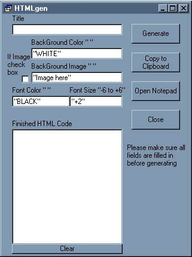



## HTML generator

### Description

A simple program to make the basic html page, Ive inserted a few features such as a shell command and copy to clip board, I tried to add some of the basics so you could see how to do the same such as if statements and check boxes. Ive commented on it and it should be real easy to read and see what Ive done.

OK I reuploaded the zip and changed the colors on the form aperently personal taste is not permitted here lol. The form is now there.
 
### More Info
 

             |
---                |---
**Submitted On**   |2001-03-18 11:14:42
**By**             |[NULL](https://github.com/Planet-Source-Code/PSCIndex/blob/master/ByAuthor/empty.md)
**Level**          |Beginner
**User Rating**    |3.4 (17 globes from 5 users)
**Compatibility**  |VB 5\.0, VB 6\.0
**Category**       |[Complete Applications](https://github.com/Planet-Source-Code/PSCIndex/blob/master/ByCategory/complete-applications__1-27.md)
**World**          |[Visual Basic](https://github.com/Planet-Source-Code/PSCIndex/blob/master/ByWorld/visual-basic.md)
**Archive File**   |[CODE\_UPLOAD172413182001\.zip](https://github.com/Planet-Source-Code/html-generator__1-21740/archive/master.zip)

